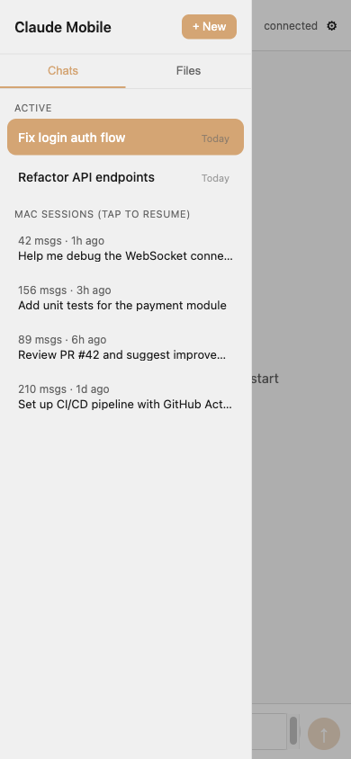
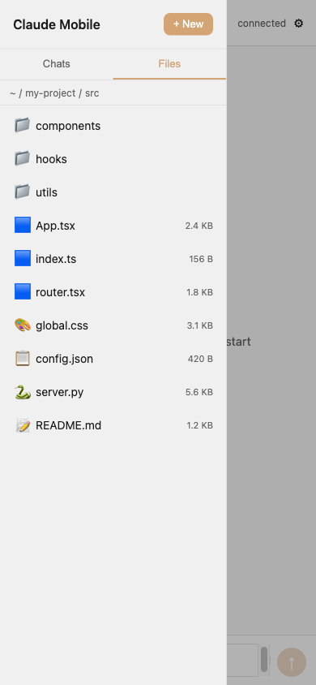
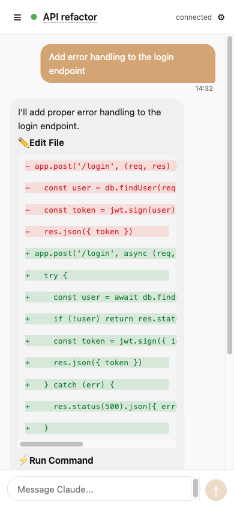
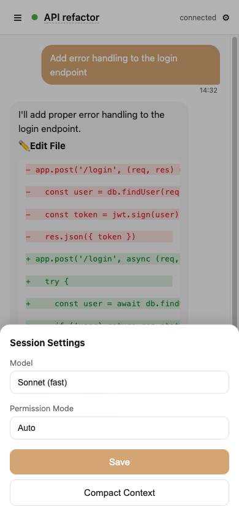

# pocket-claude

Access your Mac's Claude Code sessions from iPhone — a claude.ai-like chat interface with markdown rendering, code highlighting, and session resume.

## How It Works

```
┌─────────────────┐     Tailscale VPN      ┌─────────────────┐
│   iPhone Safari │◄─────────────────────► │   Mac           │
│   Chat UI (PWA) │     WebSocket          │   Bun Server    │
│                 │                        │       ↓         │
│   • Markdown    │                        │   claude -p     │
│   • Code HL     │                        │   --resume      │
│   • Stream      │                        │   --stream-json │
└─────────────────┘                        └─────────────────┘
```

## Features

- Chat bubble UI with markdown + syntax highlighting
- Stream output (real-time token-by-token display)
- Tool use visibility: see file edits (diff), bash commands, reads in real-time
- Resume any Mac Claude Code session from phone
- Multi-session management (create, switch, rename, delete)
- Session freshness: detects when Mac terminal updates a session
- Model switching (opus / sonnet / haiku)
- Permission mode (auto / bypass / plan)
- Abort/interrupt running conversations
- Double-tap message to copy text, copy markdown, or multi-select
- Swipe session items to reveal actions (Rename/Delete/Resume)
- File browser with syntax highlighting + copy path
- Dark/light theme (follows system)
- PWA (add to home screen, token auto-persisted)
- Token auth + Tailscale encryption

## Screenshots

| Chats & Resume | Files Browser | Chat Conversation | Model Settings |
|:-:|:-:|:-:|:-:|
|  |  |  |  |

## Quick Start

### 1. Install dependencies

```bash
# Bun runtime
curl -fsSL https://bun.sh/install | bash

# Tailscale (Mac + iPhone)
# https://tailscale.com/download
```

### 2. Clone and configure

```bash
git clone git@github.com:shinji411/pocket-claude.git
cd pocket-claude/app

# Create your config
cp config.example.json config.json
# Edit config.json — set your tailscaleIp, workDir, etc.

# Install deps
bun install
```

### 3. Configuration

Edit `app/config.json`:

```json
{
  "port": 3210,
  "host": "100.x.x.x",
  "workDir": "~/workspace",
  "defaultModel": "opus",
  "defaultPermissionMode": "auto",
  "maxHistoryMessages": 100,
  "maxFileSize": 524288,
  "hiddenFiles": [".git", "node_modules", ".DS_Store", ".env"],
  "tailscaleIp": "100.x.x.x"
}
```

| Field | Description |
|-------|-------------|
| `port` | Server port |
| `host` | Bind address (use your Mac's Tailscale IP, not `0.0.0.0`) |
| `workDir` | Claude Code working directory (`~` supported) |
| `defaultModel` | Default model for new sessions |
| `defaultPermissionMode` | Default permission mode |
| `maxHistoryMessages` | Max messages loaded per session |
| `maxFileSize` | Max file size for file viewer (bytes) |
| `hiddenFiles` | Files/dirs hidden in file browser |
| `tailscaleIp` | Your Mac's Tailscale IP (get it with `tailscale ip -4`) |

### 4. Run

```bash
# Foreground (see logs)
./run.sh

# Background (daemon)
./run.sh -d

# Other commands
./run.sh stop      # Stop daemon
./run.sh status    # Check if running
./run.sh log       # View daemon logs
./run.sh rotate    # Rotate token and restart
```

### 5. Connect

Open in browser:
- Mac: `http://localhost:3210?token=<your-token>`
- iPhone: `http://<tailscale-ip>:3210?token=<your-token>`

Token is auto-generated on first run and printed in the startup log.

## Windows

On Windows the server runs under [Git Bash](https://git-scm.com/download/win). Use the bundled launcher scripts instead of `run.sh`.

### 1. Configure your local environment

Machine-specific values (bun path, working directory, AWS profile, etc.) live in `env.local.sh`, which is **gitignored** so your private paths and account IDs never get committed. Create it from the template:

```bash
cp env.example.sh env.local.sh
# Edit env.local.sh — fill in the values you need (every field is optional;
# the scripts fall back to sensible defaults for anything left blank).
```

| Variable | Description |
|----------|-------------|
| `PC_BUN` | Absolute path to `bun.exe` (defaults to `bun` on your PATH) |
| `PC_TAILSCALE` | Path to `tailscale.exe` (defaults to `/c/Program Files/Tailscale/tailscale.exe`) |
| `POCKET_CLAUDE_CWD` | Working directory new sessions start in (defaults to the current dir) |
| `PC_USE_BEDROCK` | Set to `1` to run Claude Code via AWS Bedrock instead of your default Claude Code auth |
| `PC_AWS_PROFILE` / `PC_AWS_REGION` | AWS profile/region (only used when `PC_USE_BEDROCK=1`) |
| `PC_WORK_DIR` | tmux launcher working dir (defaults to `~/workspace`) |
| `PC_TEST_HOST` | `host:port` the E2E test client connects to (defaults to `127.0.0.1:3210`) |

### 2. Run

```bash
# Foreground, binds to your Tailscale IP so the phone can reach it
./start-windows.sh

# Local only (binds 127.0.0.1, for testing on this machine)
./start-windows.sh local

# Switch model (default is Opus 4.8)
./start-windows.sh fable

# Rotate the auth token, then start
./start-windows.sh rotate

# Stop the server (also from PowerShell/CMD: stop-windows.cmd)
```

Double-clickable wrappers `start-windows.cmd` / `stop-windows.cmd` are provided for launching from Explorer or PowerShell.

## Prerequisites

- macOS with [Claude Code](https://docs.anthropic.com/en/docs/claude-code) installed
- [Bun](https://bun.sh) runtime
- [Tailscale](https://tailscale.com) on Mac + iPhone (for remote access)
- iPhone with Safari or any modern browser

## Network Setup

1. Install Tailscale on both Mac and iPhone
2. Login with the same account
3. Get your Mac's IP: `tailscale ip -4`
4. Set it in `config.json` → `tailscaleIp`

## Usage Tips

- **Resume sessions**: Open sidebar → swipe left on Mac session → tap Resume
- **Rename/Delete**: Swipe left on active session to reveal actions, or tap header title to rename
- **Switch model**: Tap ⚙ in header → select model → Save
- **Abort**: When Claude is thinking, the send button turns red — tap to stop
- **Tool use**: File edits, bash commands show in real-time with diff highlighting
- **Copy message**: Double-tap any message bubble → choose Copy Text or Copy Markdown
- **Multi-select**: Double-tap → Select, or use the popup to enter select mode
- **Session sync**: If Mac terminal updates a session, a reload banner appears
- **File browser**: Sidebar → Files tab → browse, view, copy paths
- **PWA**: In Safari, tap Share → Add to Home Screen for app-like experience

## Project Structure

```
├── app/
│   ├── server.ts          # HTTP + WebSocket + Claude process bridge
│   ├── config.ts          # Configuration loader
│   ├── config.json        # Your local config (gitignored)
│   ├── config.example.json# Template for new users
│   ├── auth.ts            # Token authentication
│   ├── db.ts              # SQLite message persistence
│   ├── sessions.ts        # Session CRUD
│   ├── ui.ts              # Chat UI (HTML/CSS/JS)
│   └── package.json
├── run.sh                 # Launcher script (macOS/Linux)
├── start-windows.sh       # Launcher script (Windows / Git Bash)
├── start-windows.cmd      # Double-clickable wrapper (Windows)
├── stop-windows.cmd       # Stop the server (Windows)
├── start-claude.sh        # Helper: launch Claude Code in a tmux session
├── env.example.sh         # Template for local env vars
├── env.local.sh           # Your local env vars (gitignored)
├── CHANGELOG.md
└── README.md
```

## Environment Variables

Override config.json values:

```bash
POCKET_CLAUDE_PORT=3210
POCKET_CLAUDE_HOST=100.x.x.x
POCKET_CLAUDE_CWD=/path/to/workspace
```

On Windows these (and the `PC_*` launcher variables) are set in `env.local.sh` — see [Windows](#windows).

## Security

Three-layer defense in depth:

1. **Network isolation (Tailscale ACL)** — restrict which devices can reach the server port
2. **Host binding** — server listens only on Tailscale interface, invisible to LAN/internet
3. **Token auth** — 24-byte random token required on every connection

All traffic is WireGuard-encrypted end-to-end. No data leaves your devices.

### Recommended Setup

1. **Bind to Tailscale IP** (not `0.0.0.0`):

```json
{
  "host": "100.x.x.x"
}
```

2. **Configure Tailscale ACL** — only allow your iPhone to access the server port. In [Tailscale Admin → ACLs](https://login.tailscale.com/admin/acls):

```jsonc
{
  "grants": [
    {"src": ["<your-iphone-tailscale-ip>"], "dst": ["<your-mac-tailscale-ip>"], "ip": ["*:3210"]}
  ]
}
```

Get your device IPs with `tailscale status`.

3. **Rotate token** when needed:

```bash
./run.sh rotate
```

Stops the server, generates a new token, restarts, and prints the new URL. Open it on iPhone to reconnect.

### Threat Model

An attacker would need to simultaneously:
- Join your Tailscale tailnet (requires your account credentials)
- Pass the ACL check (requires your iPhone's Tailscale IP)
- Know the auth token (stored only locally)

Knowing the port number (3210) alone is not a risk — without Tailscale access, the port is unreachable.

## License

MIT
